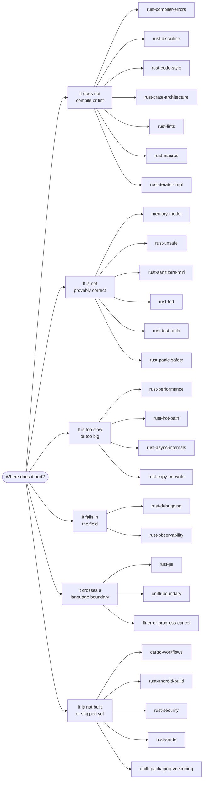

<div align="center">

# rust-skills

**Twenty-four agent skills for production Rust:**
unsafe review · atomics · FFI boundaries · sanitizers · profiling · lint policy · supply chain

[](https://github.com/po4yka/rust-skills/actions/workflows/ci.yml)
[](checks/rust-toolchain.toml)
[](LICENSE)

</div>

Each skill is a reference sheet for a coding agent, not a tutorial. The skills are generalized
from two private production codebases — an Android application with a Rust networking core, and a
cross-platform Rust map engine — so each one carries concrete commands, flags, thresholds, and
triage tables instead of general advice.

Every ` ```rust ` block in the catalog is extracted and type-checked in CI against the toolchain
that `checks/rust-toolchain.toml` pins.

## Install

```bash
npx skills add po4yka/rust-skills
```

> [!TIP]
> You do not need the whole catalog. `npx skills add po4yka/rust-skills --skill rust-unsafe`
> installs one skill, and `npx skills use po4yka/rust-skills@rust-unsafe` reads it as a prompt
> without installing anything.

<details>
<summary><b>All install options</b></summary>

<br>

| Goal | Command |
| --- | --- |
| List the catalog without installing | `npx skills add po4yka/rust-skills --list` |
| Install one skill | `npx skills add po4yka/rust-skills --skill rust-unsafe` |
| Read one skill as a prompt | `npx skills use po4yka/rust-skills@rust-unsafe` |
| Install for every project, not just this one | `npx skills add po4yka/rust-skills --global` |
| Target one agent | `npx skills add po4yka/rust-skills --agent claude-code` |
| Target every detected agent, no prompts | `npx skills add po4yka/rust-skills --all` |
| Copy files instead of symlinking | `npx skills add po4yka/rust-skills --copy` |
| Update after a new release | `npx skills update` |
| Remove one skill | `npx skills remove --skill rust-unsafe` |

The `skills` CLI installs into Claude Code, Codex, Cursor, OpenCode, and more than seventy other
agents. Run `npx skills --help` for the full flag list. The CLI is open source at
[vercel-labs/skills](https://github.com/vercel-labs/skills).

</details>

## Which skill do I need?

Enter by the symptom, not by the skill name.

| What you are looking at | Skill |
| --- | --- |
| `E0382`, `E0499`, `does not live long enough`, `missing lifetime specifier` | [rust-compiler-errors](skills/rust-compiler-errors/SKILL.md) |
| `cannot be sent between threads safely` across an `.await` | [rust-async-internals](skills/rust-async-internals/SKILL.md) |
| A `tokio::select!` branch dropped work, or shutdown hangs | [rust-async-internals](skills/rust-async-internals/SKILL.md) |
| `Ordering::Relaxed` versus `SeqCst`, a fence you cannot justify | [memory-model](skills/memory-model/SKILL.md) |
| A global: `static mut`, `OnceLock`, `LazyLock`, `thread_local!` | [memory-model](skills/memory-model/SKILL.md) |
| A macro to write or debug: `macro_rules!`, a derive, `cargo expand` | [rust-macros](skills/rust-macros/SKILL.md) |
| You implement `Iterator` or `IntoIterator` for your own type | [rust-iterator-impl](skills/rust-iterator-impl/SKILL.md) |
| A `SAFETY` comment to review, `repr(packed)`, `mem::zeroed`, `improper_ctypes` | [rust-unsafe](skills/rust-unsafe/SKILL.md) |
| Miri, ThreadSanitizer, HWASan, or MTE reports something | [rust-sanitizers-miri](skills/rust-sanitizers-miri/SKILL.md) |
| You need the profile first: flamegraph, simpleperf, `cargo-bloat` | [rust-performance](skills/rust-performance/SKILL.md) |
| The profile already named the hot spot: allocations, type size, hasher | [rust-hot-path](skills/rust-hot-path/SKILL.md) |
| Borrow or clone at an API boundary: `Cow<str>`, `to_mut`, clone cost | [rust-copy-on-write](skills/rust-copy-on-write/SKILL.md) |
| A tombstone, a stripped backtrace, `addr2line` symbolication | [rust-debugging](skills/rust-debugging/SKILL.md) |
| `UnsatisfiedLinkError`, `AttachCurrentThread`, a native crash from Kotlin | [rust-jni](skills/rust-jni/SKILL.md) |
| UniFFI checksum mismatch, XCFramework or jniLibs packaging | [uniffi-packaging-versioning](skills/uniffi-packaging-versioning/SKILL.md) |
| A `RUSTSEC` advisory, or a new dependency nobody vetted | [rust-security](skills/rust-security/SKILL.md) |
| `deny_unknown_fields` or `rename_all` broke the wire format | [rust-serde](skills/rust-serde/SKILL.md) |
| 16 KiB page alignment, NDK linkers, per-ABI rustflags, `.so` size gates | [rust-android-build](skills/rust-android-build/SKILL.md) |

The full phrase-to-skill list lives in [tests/routing-cases.md](tests/routing-cases.md), and CI
checks every row against the skill descriptions.



## Catalog

Twenty-seven skills in six groups. Deep material sits in `references/*.md` next to the skill that
owns it.

<details open>
<summary><b>Language and code discipline</b> — seven skills</summary>

<br>

| Skill | What it covers |
| --- | --- |
| [rust-compiler-errors](skills/rust-compiler-errors/SKILL.md) | A triage table from error code to cause, the reflexive fixes that hide the bug, split-borrow patterns, `Send` across `.await`, and when a repeated error means the ownership design is wrong. |
| [rust-discipline](skills/rust-discipline/SKILL.md) | API design, panic policy, allocation in hot paths, concurrency primitive choice, unsafe encapsulation, and FFI review gates with a checklist. |
| [rust-code-style](skills/rust-code-style/SKILL.md) | Module file layout, `lib.rs` re-export policy, visibility levels, item order, import groups, and the `thiserror` versus `anyhow` choice. |
| [rust-crate-architecture](skills/rust-crate-architecture/SKILL.md) | Workspace layering, dependency direction rules, the crate-versus-module decision, and module layout for a crate that grew too large. |
| [rust-lints](skills/rust-lints/SKILL.md) | `workspace.lints`, `clippy.toml`, `rustfmt.toml`, and `deny.toml` policy, safe lint tightening, suppression justification, and red-gate triage. |
| [rust-macros](skills/rust-macros/SKILL.md) | `macro_rules!` textual scope and hygiene, fragment follow sets, the recursion limit, proc-macro crate rules, and the facade-and-derive crate split. |
| [rust-iterator-impl](skills/rust-iterator-impl/SKILL.md) | The producing side of iteration: a hand-written `Iterator`, the three `IntoIterator` impls, `FromIterator` and `Extend`, `size_hint`, and the `unconditional_recursion` stack overflow. |

</details>

<details>
<summary><b>Build, dependencies, and supply chain</b> — four skills</summary>

<br>

| Skill | What it covers |
| --- | --- |
| [cargo-workflows](skills/cargo-workflows/SKILL.md) | Workspace layout, `--locked` discipline, Cargo profiles and rustflags, cross-compilation, nextest, cargo-deny, and edition migration. |
| [rust-serde](skills/rust-serde/SKILL.md) | `deny_unknown_fields` and the `rename_all` migration trap, the four enum representations and their wire forms, `flatten` constraints, boundary validation with `try_from`, and the `default` plus `alias` pair for version compatibility. |
| [rust-security](skills/rust-security/SKILL.md) | cargo-audit, cargo-deny policy, RUSTSEC advisory triage, new-crate vetting against typosquat risk, and untrusted-input parser hardening. |
| [rust-android-build](skills/rust-android-build/SKILL.md) | Android cdylib builds: NDK linkers, per-ABI rustflags, 16 KiB page alignment, the exported ELF symbol allowlist, and `.so` size gates. |

</details>

<details>
<summary><b>Correctness and testing</b> — four skills</summary>

<br>

| Skill | What it covers |
| --- | --- |
| [rust-tdd](skills/rust-tdd/SKILL.md) | The red-green-refactor-lint cycle, nextest filters, hand-written fakes, fault-injection queues, and golden contracts with a safe bless procedure. |
| [rust-test-tools](skills/rust-test-tools/SKILL.md) | nextest, cargo-careful, loom, proptest, cargo-fuzz, cargo-mutants survived-mutant triage, and deterministic golden tests. |
| [rust-sanitizers-miri](skills/rust-sanitizers-miri/SKILL.md) | ASan, TSan, and MSan flags, Miri UB detection and FFI stubbing, HWASan and MTE on device, and sanitizer report triage. |
| [rust-panic-safety](skills/rust-panic-safety/SKILL.md) | Unwind versus abort, `catch_unwind` guards at FFI boundaries, unwrap and expect audits, panic hooks, and typed-error mapping. |

</details>

<details>
<summary><b>Concurrency and unsafe code</b> — three skills</summary>

<br>

| Skill | What it covers |
| --- | --- |
| [memory-model](skills/memory-model/SKILL.md) | Atomic ordering selection, happens-before reasoning, fence placement, compare-exchange rules, and verification with Miri and loom. |
| [rust-async-internals](skills/rust-async-internals/SKILL.md) | `tokio::select!` and cancel safety, `CancellationToken` shutdown trees, blocking-work routing, and async stall and shutdown-hang triage. |
| [rust-unsafe](skills/rust-unsafe/SKILL.md) | The unsafe lint floor, SAFETY comment discipline, FFI panic guards, unaligned reads from untrusted bytes, and Miri Tree Borrows review. |

</details>

<details>
<summary><b>Performance, debugging, and observability</b> — five skills</summary>

<br>

| Skill | What it covers |
| --- | --- |
| [rust-performance](skills/rust-performance/SKILL.md) | Flamegraphs, simpleperf and Instruments, cargo-bloat and cargo-llvm-lines, Criterion baselines, LTO profiles, and build-time tuning. |
| [rust-hot-path](skills/rust-hot-path/SKILL.md) | What to change once a profile names the hot spot: allocation rate, type size, hasher choice, bounds checks, inline attributes, and buffered I/O. |
| [rust-copy-on-write](skills/rust-copy-on-write/SKILL.md) | The decision before the profile: `Cow` in return and argument position, the `to_mut` allocation trap, the lifetime a `Cow` field forces on callers, and measured persistent-collection costs. |
| [rust-debugging](skills/rust-debugging/SKILL.md) | Host-first reproduction, logcat and tombstones, symbolication with addr2line and atos, FFI panic hooks, and a panic-to-cause triage table. |
| [rust-observability](skills/rust-observability/SKILL.md) | `tracing` instrumentation, a redacting visitor over a closed field vocabulary, host log sinks, bounded event rings, and telemetry snapshots. |

</details>

<details>
<summary><b>FFI and platform boundaries</b> — four skills</summary>

<br>

| Skill | What it covers |
| --- | --- |
| [rust-jni](skills/rust-jni/SKILL.md) | JNI export symbol naming, panic containment, thread attach and detach discipline, local-reference frames, and native crash triage. |
| [uniffi-boundary](skills/uniffi-boundary/SKILL.md) | The Record-versus-Object decision, `Arc` ownership across the boundary, callback interfaces, type mapping, and codegen failure triage. |
| [uniffi-packaging-versioning](skills/uniffi-packaging-versioning/SKILL.md) | Artifact packaging for jniLibs and XCFramework, binding and runtime version pinning, and checksum-mismatch debugging. |
| [ffi-error-progress-cancel](skills/ffi-error-progress-cancel/SKILL.md) | A flat versioned error taxonomy, progress bridges to Kotlin `callbackFlow` and Swift `AsyncThrowingStream`, and cooperative `cancel_job`. |

</details>

## How the skills activate

Each `SKILL.md` carries a `description` that states what the skill covers and when to reach for
it. The agent reads those descriptions and loads the body only when the task matches, so the
catalog costs little context until a skill is needed. The descriptions in this repository list
their trigger terms explicitly, for example `unsafe`, `transmute`, `RUSTSEC`, `cargo deny`,
`stacked borrows`, `tokio::select!`, or `uniffi::export`.

You can also read any skill directly. Every `SKILL.md` is plain Markdown.

`SKILL.md` frontmatter holds only the three keys that the
[Agent Skills specification](https://agentskills.io/specification) allows here: `name`,
`description`, and `license`. The `name` always equals the directory name.

## Repository layout

```text
skills/<skill-name>/
├── SKILL.md                  # frontmatter plus instructions
└── references/*.md           # optional deep material, linked from SKILL.md

scripts/validate-skills.py    # catalog structure checks
tests/routing-cases.md        # phrase -> skill, checked against every description
checks/                       # compile-check harness for the rust examples
checks/check.sh               # one command that reproduces CI
```

Only `skills/` is published. The rest is tooling; `npx skills add` never sees it.

## Scope

The catalog covers Rust. Android and iOS material appears only where it belongs to a Rust
concern, such as an NDK cross-compilation profile, a JNI boundary, or an XCFramework that wraps
a Rust staticlib. The skills assume you already know Rust; they encode review rules, tool
invocations, and failure triage that a codebase learns the hard way.

## Caveats

> [!WARNING]
> CI type-checks the Rust examples. It does **not** check whether a command line, a flag, or a
> version number is still correct — those come from the source codebases and from tool
> documentation. Verify a command against your own toolchain before you put it in a script.

- Every ` ```rust ` block in the catalog is extracted and type-checked in CI against the
  toolchain `checks/rust-toolchain.toml` pins, currently Rust 1.97 on edition 2024. Blocks that
  cannot compile standalone carry a fence tag saying so.
- Pinned versions age. Where a skill names a crate or tool version, treat it as the version the
  rule was written against, and confirm it against your `Cargo.lock`.
- A few thresholds are conventions rather than measured limits, for example the mutation-score
  target and the crate-size tiers. The skills say so at the point of use.

## Contributing

Read [AGENTS.md](AGENTS.md). It states the `SKILL.md` contract, the authoring conventions, how to
add a skill, and how to verify a change locally before you open a pull request.

## Sources

The skills are generalized from production Rust codebases. Five additions have an outside source,
recorded here because the topic inventory is theirs even though the text and the examples are not.

<details>
<summary><b>Attribution in full</b></summary>

<br>

- The FFI layout and pointer-shape rules in `rust-unsafe/references/ffi-layout-rules.md` follow
  the topic set of the `unsafe-checker` rules in
  [actionbook/rust-skills](https://github.com/actionbook/rust-skills) (MIT), which in turn maps
  the `P.UNS` and `G.UNS` rules of the
  [Rust Coding Guidelines](https://rust-coding-guidelines.github.io/rust-coding-guidelines-zh/).
  The prose, the examples, and the rustc 1.97 verification here are original; several upstream
  rules were dropped as out of date, including one that cites the removed clippy lint
  `unaligned_references` for what is now the hard error `E0793`.
- The idea of a compiler-error index that routes a diagnostic to a skill comes from the same
  repository. The triage table, the fix catalogue, and the escalation rule in
  `rust-compiler-errors` are written here from the compiler's own output.
- The topic inventory of `rust-hot-path` follows
  [The Rust Performance Book](https://github.com/nnethercote/perf-book) by Nicholas Nethercote
  (MIT or Apache-2.0): allocation rate, type sizes, hashing, iterators, bounds checks, inlining,
  and buffered I/O are its chapter set. The prose, the examples, and every number here are
  original and were measured on rustc 1.97.0, which corrected several upstream claims. The
  memcpy boundary the book gives as 128 bytes is the x86_64 figure; aarch64 copies inline up to
  256. `Vec`'s first non-zero capacity is not 4; it depends on the element size. The jemalloc
  build-time and run-time configuration variables are the other way round. `fnv` is not a middle
  option between `rustc-hash` and SipHash on string keys. Locking stdout in a loop no longer
  helps on its own. `-C symbol-mangling-version=v0` and `-fuse-ld=lld` on Linux are both no-ops
  on a current toolchain, and `static_assertions` has not shipped since 2019.
- The topic inventory of `rust-macros`, `rust-iterator-impl`, `rust-copy-on-write`, and
  `rust-discipline/references/trait-resolution.md` follows the source code of
  [Idiomatic Rust: Code like a Rustacean](https://github.com/brndnmtthws/idiomatic-rust-book) by
  Brenden Matthews (MIT): trait design, extension traits, typestate, macro authoring, `Cow` and
  persistent collections, and `Deref` misuse are its chapter set. That repository ships listings
  and no prose, so every rule, example, and number here is original and was measured on rustc
  1.97.0. Several upstream listings are the counter-example rather than the model. The book's
  `Cow` demo calls `to_mut()` before a read-only `replace`, which forces the allocation the
  `Cow` exists to avoid. Its linked-list iterator fabricates a `&'a T` out of an
  `Rc<RefCell<T>>` with `unsafe { &*cell.as_ptr() }`; both Miri borrow models report undefined
  behaviour as soon as a mutation interleaves, and the book's own `main` never interleaves, so
  the test passes. Its optional-argument pattern puts one method name on two traits, which is
  `E0034` the moment both are in scope. Its `WrappedVec` implements `Deref` to `Vec<T>` and an
  inherent `into_iter`, the two shapes chapter 10 of the same book argues against. Its derive
  example points the dependency from the derive crate at the trait crate, so a user must depend
  on both; the facade re-export runs the other way.

- The compile-check harness in `checks/` is adapted from
  [leonardomso/rust-skills](https://github.com/leonardomso/rust-skills) (MIT). The design that
  makes it work is theirs: extract each block into a cargo example, bucket the failures so
  illustrative fragments do not drown a real defect, and gate on a signature that carries no
  line number. The extractor and the analyzer here are rewritten for this layout, with a
  `Result<T>` alias for the crate-local alias skills assume, rustdoc fence tags as the opt-out,
  and an empty baseline instead of an accepted-suspect list.

</details>

## License

BSD-3-Clause. See [LICENSE](LICENSE).
