<div align="center">

# rust-skills

**Forty-four agent skills for production Rust:**
ownership semantics · unsafe review · async · mobile delivery · FFI · native linking · releases · supply chain

[](https://github.com/po4yka/rust-skills/actions/workflows/ci.yml)
[](checks/rust-toolchain.toml)
[](LICENSE)

</div>

Each skill is a reference sheet for a coding agent, not a tutorial. Each one carries concrete
commands, flags, thresholds, and triage tables instead of general advice.

Every ` ```rust ` block in the catalog declares what CI must do with it, and CI does it on the
toolchain that `checks/rust-toolchain.toml` pins. An untagged block is extracted and
type-checked; a `rust,run` block must also execute successfully; a `rust,compile_fail` block has
to fail and can name the required error code; `rust,ignore` is the only way a block leaves the
gate. Nothing is skipped in silence.

## Install

```bash
npx skills add po4yka/rust-skills
```

> [!TIP]
> You do not need the whole catalog. `npx skills add po4yka/rust-skills --skill rust-unsafe`
> installs one skill, and `npx skills use po4yka/rust-skills@rust-unsafe` reads it as a prompt
> without installing anything.

<details>
<summary><b>All install options</b></summary>

<br>

| Goal | Command |
| --- | --- |
| List the catalog without installing | `npx skills add po4yka/rust-skills --list` |
| Install one skill | `npx skills add po4yka/rust-skills --skill rust-unsafe` |
| Read one skill as a prompt | `npx skills use po4yka/rust-skills@rust-unsafe` |
| Install for every project, not just this one | `npx skills add po4yka/rust-skills --global` |
| Target one agent | `npx skills add po4yka/rust-skills --agent claude-code` |
| Target every detected agent, no prompts | `npx skills add po4yka/rust-skills --all` |
| Copy files instead of symlinking | `npx skills add po4yka/rust-skills --copy` |
| Update after a new release | `npx skills update` |
| Remove one skill | `npx skills remove --skill rust-unsafe` |

> **Checkout data-loss warning:** Never run `skills remove` from this
> repository's checkout. The CLI can treat the source `skills/` directory as
> an install location and delete the selected source directory. An uncommitted
> skill cannot be recovered from Git. Run removal from the project that owns
> the installation or from a scratch directory outside this checkout.

The `skills` CLI installs into Claude Code, Codex, Cursor, OpenCode, and other supported agents.
Run `npx skills --help` for the current agent and flag list. The CLI is open source at
[vercel-labs/skills](https://github.com/vercel-labs/skills).

</details>

## Which skill do I need?

Enter by the symptom, not by the skill name.

| What you are looking at | Skill |
| --- | --- |
| `E0382`, `E0499`, E0282/E0283/E0284, or `does not live long enough` | [rust-compiler-errors](skills/rust-compiler-errors/SKILL.md) |
| A temporary lifetime, drop scope, two-phase borrow, or method autoref depends on syntax | [rust-borrow-semantics](skills/rust-borrow-semantics/SKILL.md) |
| A match guard, partial move, binding mode, or match ergonomics change is surprising | [rust-pattern-semantics](skills/rust-pattern-semantics/SKILL.md) |
| `cannot be sent between threads safely` across an `.await` | [rust-async-internals](skills/rust-async-internals/SKILL.md) |
| A disabled `tokio::select!` branch has side effects, a `JoinHandle` detached, or shutdown hangs | [rust-async-internals](skills/rust-async-internals/SKILL.md) |
| `Ordering::Relaxed` versus `SeqCst`, a fence you cannot justify | [memory-model](skills/memory-model/SKILL.md) |
| A global: `static mut`, `OnceLock`, `LazyLock`, `thread_local!` | [memory-model](skills/memory-model/SKILL.md) |
| A macro to write or debug: `macro_rules!`, a derive, `cargo expand` | [rust-macros](skills/rust-macros/SKILL.md) |
| You implement `Iterator` or `IntoIterator` for your own type | [rust-iterator-impl](skills/rust-iterator-impl/SKILL.md) |
| A `SAFETY` comment, `MaybeUninit`, Strict Provenance, `repr(packed)`, or `mem::zeroed` | [rust-unsafe](skills/rust-unsafe/SKILL.md) |
| Miri, ThreadSanitizer, HWASan, or MTE reports something | [rust-sanitizers-miri](skills/rust-sanitizers-miri/SKILL.md) |
| You need the profile first: flamegraph, simpleperf, `cargo-bloat` | [rust-performance](skills/rust-performance/SKILL.md) |
| The profile already named the hot spot: allocations, type size, hasher | [rust-hot-path](skills/rust-hot-path/SKILL.md) |
| Borrow or clone at an API boundary: `Cow<str>`, `to_mut`, clone cost | [rust-copy-on-write](skills/rust-copy-on-write/SKILL.md) |
| A tombstone, a stripped backtrace, `addr2line` symbolication | [rust-debugging](skills/rust-debugging/SKILL.md) |
| `UnsatisfiedLinkError`, `AttachCurrentThread`, `FindClass`, or an Android ClassLoader failure | [rust-jni](skills/rust-jni/SKILL.md) |
| Swift calls Rust through a C ABI, an opaque handle, or an `@MainActor` callback | [rust-swift-ffi](skills/rust-swift-ffi/SKILL.md) |
| UniFFI packaging, checksum mismatch, mobile support matrix, or final-artifact release proof | [uniffi-packaging-versioning](skills/uniffi-packaging-versioning/SKILL.md) |
| `Activity` lifecycle, `ViewModel.onCleared`, process death, or a callback release race | [ffi-error-progress-cancel](skills/ffi-error-progress-cancel/SKILL.md) |
| A `RUSTSEC` advisory, or a new dependency nobody vetted | [rust-security](skills/rust-security/SKILL.md) |
| `DeserializeOwned`, a JSON map key, a large integer, or `rename_all` broke the wire format | [rust-serde](skills/rust-serde/SKILL.md) |
| Method ambiguity, autoderef, UFCS, E0034, or blanket-impl overlap | [rust-discipline](skills/rust-discipline/SKILL.md) |
| A caught panic aborts while its payload is dropped | [rust-panic-safety](skills/rust-panic-safety/SKILL.md) |
| A lifetime coercion is refused: `is invariant over the parameter`, `borrowed for 'static` | [rust-variance](skills/rust-variance/SKILL.md) |
| A callback bound rejects `|o| &o.field`, or a struct field holds a closure | [rust-callback-bounds](skills/rust-callback-bounds/SKILL.md) |
| `self: Pin<&mut Self>`, `PhantomPinned`, or a `#[pin]` projection | [rust-pin-projection](skills/rust-pin-projection/SKILL.md) |
| `cannot be sent between threads safely`, `MutexGuard` is not `Send` | [rust-send-sync](skills/rust-send-sync/SKILL.md) |
| A `HashMap<TypeId, _>` whose values borrow, `dyn Any`, `downcast_ref` | [rust-type-erasure](skills/rust-type-erasure/SKILL.md) |
| Every handler in an event loop needs `&mut` to one shared state | [rust-event-loop-state](skills/rust-event-loop-state/SKILL.md) |
| 16 KiB page alignment, native debug symbols, or an Android AAR or Prefab package | [rust-android-build](skills/rust-android-build/SKILL.md) |
| `Rust for iOS`, `IPHONEOS_DEPLOYMENT_TARGET`, XCFramework assembly outside UniFFI | [rust-ios-build](skills/rust-ios-build/SKILL.md) |
| A SemVer bump, `cargo package`, `cargo publish`, or crates.io recovery | [rust-crate-release](skills/rust-crate-release/SKILL.md) |
| `build.rs`, `pkg-config`, an undefined symbol, or a packaged DLL failure | [rust-native-linking](skills/rust-native-linking/SKILL.md) |
| HTTP timeout, safe retries, TLS verification, body limits, or graceful shutdown | [rust-networking](skills/rust-networking/SKILL.md) |
| Pool exhaustion, transaction rollback, migration ordering, or serialization failure | [rust-database](skills/rust-database/SKILL.md) |
| `wasm32-unknown-unknown`, WASI, `wasm-bindgen`, or a WebAssembly size regression | [rust-wasm](skills/rust-wasm/SKILL.md) |
| `no_std`, `memory.x`, an interrupt race, Embassy, RTIC, `probe-rs`, or `defmt` | [rust-embedded-no-std](skills/rust-embedded-no-std/SKILL.md) |
| `clap` arguments, stdout or exit-code compatibility, Ctrl-C, atomic output, or shell completions | [rust-cli](skills/rust-cli/SKILL.md) |

The full phrase-to-skill list lives in [tests/routing-cases.md](tests/routing-cases.md), and CI
checks every row against the skill descriptions.

```mermaid
flowchart LR
    Q(["Where does it hurt?"])

    Q --> A["It does not<br/>compile or lint"]
    Q --> B["It is not<br/>provably correct"]
    Q --> C["It is too slow<br/>or too big"]
    Q --> D["It fails in<br/>the field"]
    Q --> E["It crosses a<br/>language boundary"]
    Q --> F["It is not built<br/>or shipped yet"]
    Q --> G["It is a command-line<br/>interface"]

    A --> A1[rust-compiler-errors]
    A --> A2[rust-discipline]
    A --> A3[rust-code-style]
    A --> A4[rust-crate-architecture]
    A --> A5[rust-lints]
    A --> A6[rust-macros]
    A --> A7[rust-iterator-impl]
    A --> A8[rust-variance]
    A --> A9[rust-callback-bounds]
    A --> A10[rust-type-erasure]
    A --> A11[rust-event-loop-state]
    A --> A12[rust-borrow-semantics]
    A --> A13[rust-pattern-semantics]

    B --> B1[memory-model]
    B --> B2[rust-unsafe]
    B --> B3[rust-sanitizers-miri]
    B --> B4[rust-tdd]
    B --> B5[rust-test-tools]
    B --> B6[rust-panic-safety]
    B --> B7[rust-pin-projection]
    B --> B8[rust-send-sync]

    C --> C1[rust-performance]
    C --> C2[rust-hot-path]
    C --> C3[rust-async-internals]
    C --> C4[rust-copy-on-write]

    D --> D1[rust-debugging]
    D --> D2[rust-observability]
    D --> D3[rust-networking]
    D --> D4[rust-database]

    E --> E1[rust-jni]
    E --> E2[rust-swift-ffi]
    E --> E3[uniffi-boundary]
    E --> E4[ffi-error-progress-cancel]

    F --> F1[cargo-workflows]
    F --> F2[rust-android-build]
    F --> F3[rust-ios-build]
    F --> F4[rust-security]
    F --> F5[rust-serde]
    F --> F6[uniffi-packaging-versioning]
    F --> F7[rust-crate-release]
    F --> F8[rust-native-linking]
    F --> F9[rust-wasm]
    F --> F10[rust-embedded-no-std]

    G --> G1[rust-cli]
```



## Catalog

Forty-four skills in six groups. Deep material sits in `references/*.md` next to the skill that
owns it.

<details open>
<summary><b>Language, interfaces, and code discipline</b> — thirteen skills</summary>

<br>

| Skill | What it covers |
| --- | --- |
| [rust-compiler-errors](skills/rust-compiler-errors/SKILL.md) | Diagnostic triage, root-cause grouping, E0282/E0283/E0284 type anchors, borrow fixes, `Send` across `.await`, and syntax-sensitive E0716 routing. |
| [rust-borrow-semantics](skills/rust-borrow-semantics/SKILL.md) | Syntax-sensitive temporary lifetimes, drop scopes, place and value expressions, method autoref, and reservation versus activation in two-phase borrows. |
| [rust-pattern-semantics](skills/rust-pattern-semantics/SKILL.md) | Binding modes, partial moves, match-guard repetition, scrutinee ownership, or-patterns, exhaustiveness policy, and edition 2024 match ergonomics. |
| [rust-discipline](skills/rust-discipline/SKILL.md) | API and trait design, method lookup, autoderef and UFCS, coherence, panic policy, hot-path allocation, concurrency choices, and FFI review gates. |
| [rust-code-style](skills/rust-code-style/SKILL.md) | Module file layout, `lib.rs` re-export policy, visibility levels, item order, import groups, and the `thiserror` versus `anyhow` choice. |
| [rust-crate-architecture](skills/rust-crate-architecture/SKILL.md) | Workspace layering, dependency direction rules, the crate-versus-module decision, and module layout for a crate that grew too large. |
| [rust-lints](skills/rust-lints/SKILL.md) | `workspace.lints`, `clippy.toml`, `rustfmt.toml`, and `deny.toml` policy, safe lint tightening, suppression justification, and red-gate triage. |
| [rust-macros](skills/rust-macros/SKILL.md) | `macro_rules!` textual scope and hygiene, fragment follow sets, the recursion limit, proc-macro crate rules, and the facade-and-derive crate split. |
| [rust-iterator-impl](skills/rust-iterator-impl/SKILL.md) | The producing side of iteration: a hand-written `Iterator`, the three `IntoIterator` impls, `FromIterator` and `Extend`, `size_hint`, and the `unconditional_recursion` stack overflow. |
| [rust-variance](skills/rust-variance/SKILL.md) | Variance, subtyping, and lifetime coercion: the two probe functions that settle any case in one `rustc` run, the table for every constructor and `PhantomData` form, why a trait bound matches by equality, and why adding interior mutability is a breaking change. |
| [rust-callback-bounds](skills/rust-callback-bounds/SKILL.md) | Callable bounds, HRTB reference projections, positional inference, `move` call traits, capture precision and drop timing, plus generic fields against `Box<dyn Fn>`. |
| [rust-type-erasure](skills/rust-type-erasure/SKILL.md) | Type-keyed storage when the values are not `'static`: why `Any` is bound to `'static`, the ladder from a lifetime-parameterized enum to a `Box<dyn Any>` map to the GAT owner/element bijection, and where the pattern turns unsound. |
| [rust-cli](skills/rust-cli/SKILL.md) | Stable command-line contracts for arguments, stdout and stderr, exit status, configuration precedence, signals, terminal behavior, atomic file output, and packaged shell completions. |

</details>

<details>
<summary><b>Build, dependencies, and supply chain</b> — nine skills</summary>

<br>

| Skill | What it covers |
| --- | --- |
| [cargo-workflows](skills/cargo-workflows/SKILL.md) | Workspace and lockfile discipline, resolver and MSRV lanes, project-owned feature matrices, target runners, Cargo config lookup, and staged edition migration. |
| [rust-crate-release](skills/rust-crate-release/SKILL.md) | SemVer and MSRV classification, registry publishing, deterministic binary archives, checksums, SBOMs, provenance, signing, consumer verification, and release recovery. |
| [rust-native-linking](skills/rust-native-linking/SKILL.md) | Cargo native integration, deterministic build scripts, separate Rust and native compiler flags, bindings, cross-target linking, and Windows MSVC/GNU verification. |
| [rust-serde](skills/rust-serde/SKILL.md) | Wire compatibility, owned versus borrowed deserialization, format-specific map keys, large-number policy, boundary validation, and exact-format round trips. |
| [rust-security](skills/rust-security/SKILL.md) | cargo-audit, cargo-deny policy, RUSTSEC advisory triage, new-crate vetting against typosquat risk, and untrusted-input parser hardening. |
| [rust-android-build](skills/rust-android-build/SKILL.md) | Android cdylib builds, NDK and per-ABI flags, 16 KiB alignment, ELF and size gates, native debug symbols, installed release smoke tests, and reusable AAR or Prefab packages. |
| [rust-ios-build](skills/rust-ios-build/SKILL.md) | iOS device and simulator static libraries, C headers and modulemaps, XCFramework and SwiftPM packaging, deployment-target and symbol verification, and simulator and device release smoke tests. |
| [rust-wasm](skills/rust-wasm/SKILL.md) | Exact WebAssembly host and target selection, JavaScript boundary ownership, panic and async behavior, WASI capabilities, runtime tests, feature compatibility, and packaged size gates. |
| [rust-embedded-no-std](skills/rust-embedded-no-std/SKILL.md) | Bare-metal and `no_std` policy for runtime and memory layout, panic and allocation, interrupts and critical sections, task frameworks, finite resource budgets, and real-device diagnostics. |

</details>

<details>
<summary><b>Correctness and testing</b> — four skills</summary>

<br>

| Skill | What it covers |
| --- | --- |
| [rust-tdd](skills/rust-tdd/SKILL.md) | The red-green-refactor-lint cycle, nextest filters, hand-written fakes, fault-injection queues, and golden contracts with a safe bless procedure. |
| [rust-test-tools](skills/rust-test-tools/SKILL.md) | nextest, cargo-careful, loom, proptest, cargo-fuzz, cargo-mutants survived-mutant triage, and deterministic golden tests. |
| [rust-sanitizers-miri](skills/rust-sanitizers-miri/SKILL.md) | ASan, TSan, and MSan, Miri validity and provenance checks, bounded many-seed schedules, FFI stubbing, HWASan and MTE, and report triage. |
| [rust-panic-safety](skills/rust-panic-safety/SKILL.md) | Unwind versus abort, FFI panic guards, safe disposal of a panicking payload, unwrap and expect audits, privacy-safe hooks, and typed-error mapping. |

</details>

<details>
<summary><b>Concurrency and unsafe code</b> — six skills</summary>

<br>

| Skill | What it covers |
| --- | --- |
| [memory-model](skills/memory-model/SKILL.md) | Atomic ordering selection, happens-before reasoning, fence placement, compare-exchange rules, and verification with Miri and loom. |
| [rust-async-internals](skills/rust-async-internals/SKILL.md) | `tokio::select!` evaluation and cancel safety, task ownership and detached handles, async closure lending, shutdown trees, and blocking-work routing. |
| [rust-unsafe](skills/rust-unsafe/SKILL.md) | The unsafe lint floor, validity and Strict Provenance, SAFETY comments, FFI panic guards, unaligned reads, and Miri Tree Borrows review. |
| [rust-pin-projection](skills/rust-pin-projection/SKILL.md) | `Pin`, `Unpin` and `PhantomPinned`: why a `Pin` on an `Unpin` type enforces nothing, `std::pin::pin!` against `Box::pin` and `Pin::new_unchecked`, the four structural pinning obligations, and `pin-project` against `pin-project-lite`. |
| [rust-send-sync](skills/rust-send-sync/SKILL.md) | The auto traits as a subject: `&T: Send` exactly when `T: Sync`, the reference and smart-pointer table, `Mutex` against `RwLock` payload bounds, `MutexGuard` as `!Send` but `Sync`, and `PhantomData` markers that remove exactly one trait. |
| [rust-event-loop-state](skills/rust-event-loop-state/SKILL.md) | Who owns the handler set and who owns the state in a tick loop, state as a trait parameter with capability bounds, when an ECS-shaped world earns its runtime conflict panic, and why `async fn(&mut State)` cannot suspend over shared state. |

</details>

<details>
<summary><b>Networking, database, performance, debugging, and observability</b> — seven skills</summary>

<br>

| Skill | What it covers |
| --- | --- |
| [rust-performance](skills/rust-performance/SKILL.md) | Flamegraphs, simpleperf and Instruments, cargo-bloat and cargo-llvm-lines, Criterion baselines, LTO profiles, and build-time tuning. |
| [rust-hot-path](skills/rust-hot-path/SKILL.md) | What to change once a profile names the hot spot: allocation rate, type size, hasher choice, bounds checks, inline attributes, and buffered I/O. |
| [rust-copy-on-write](skills/rust-copy-on-write/SKILL.md) | The decision before the profile: `Cow` in return and argument position, the `to_mut` allocation trap, the lifetime a `Cow` field forces on callers, and measured persistent-collection costs. |
| [rust-debugging](skills/rust-debugging/SKILL.md) | Host-first reproduction, logcat and tombstones, symbolication with addr2line and atos, FFI panic hooks, and a panic-to-cause triage table. |
| [rust-observability](skills/rust-observability/SKILL.md) | `tracing`, production metric contracts, histogram and cardinality budgets, OpenTelemetry context propagation, redaction, bounded exporters, host sinks, and telemetry snapshots. |
| [rust-networking](skills/rust-networking/SKILL.md) | Production client and server policy for deadline budgets, safe retries, TLS, proxy and DNS, connection pools, streaming limits, overload, cancellation, and graceful shutdown. |
| [rust-database](skills/rust-database/SKILL.md) | Production database policy for pool budgets, transaction ownership, cancellation, isolation and bounded retries, compatible migrations, and real-schema integration tests. |

</details>

<details>
<summary><b>FFI and platform boundaries</b> — five skills</summary>

<br>

| Skill | What it covers |
| --- | --- |
| [rust-jni](skills/rust-jni/SKILL.md) | JNI symbols and panic containment, thread attachment, local references, Android ClassLoader-safe caches, R8 lookup tests, and native crash triage. |
| [rust-swift-ffi](skills/rust-swift-ffi/SKILL.md) | A hand-written Rust C ABI for Swift with opaque handles, allocator symmetry, callback lifetime, Swift concurrency isolation, cancellation, and real consumer tests. |
| [uniffi-boundary](skills/uniffi-boundary/SKILL.md) | Record-versus-Object shape, `Arc` ownership, callbacks, type mapping, async exports, and mobile engine ownership across Kotlin and Swift. |
| [uniffi-packaging-versioning](skills/uniffi-packaging-versioning/SKILL.md) | jniLibs and XCFramework packaging, binding/runtime pinning, mobile support matrices, exact consumer-artifact device proof, and immutable release closures. |
| [ffi-error-progress-cancel](skills/ffi-error-progress-cancel/SKILL.md) | Versioned errors, progress and cooperative cancellation, plus mobile owner teardown, UI delivery, process restart, memory pressure, and callback-release races. |

</details>

## How the skills activate

Each `SKILL.md` carries a `description` that states what the skill covers and when to reach for
it. The agent reads those descriptions and loads the body only when the task matches, so the
catalog costs little context until a skill is needed. The descriptions in this repository list
their trigger terms explicitly, for example `unsafe`, `transmute`, `RUSTSEC`, `cargo deny`,
`temporary lifetime`, `match guard`, `Strict Provenance`, `tokio::select!`, or `uniffi::export`.

You can also read any skill directly. Every `SKILL.md` is plain Markdown.

The [Agent Skills specification](https://agentskills.io/specification) requires `name` and
`description`, and allows `license`, `compatibility`, `metadata`, and `allowed-tools`. This
repository uses three of them — `name`, `description`, and `license` — and requires all three;
that is a rule of this catalog, not of the specification. The `name` always equals the directory
name. Every value stays a plain YAML scalar, because the skills CLI and the agent runtimes read
the file with a real YAML parser.

## Repository layout

```text
skills/<skill-name>/
├── SKILL.md                  # frontmatter plus instructions
└── references/*.md           # optional deep material, linked from SKILL.md

scripts/validate-skills.py    # catalog structure checks
scripts/test_validate_skills.py # tests for the catalog rules
tests/routing-cases.md        # phrase -> skill, checked against every description
checks/gen.py                 # Rust fence extraction
checks/analyze.py             # compile-result classifier and gates
checks/test_gen.py            # executable-fence regression tests
checks/check.sh               # compile, behavior, routing, and discovery gates
research/                     # primary-source findings and skill-gap decisions
```

Only `skills/` is published. The rest is tooling; `npx skills add` never sees it.

## Scope

The catalog covers Rust. Android and iOS material appears only where it belongs to a Rust
concern, such as an NDK cross-compilation profile, a JNI boundary, or an XCFramework that wraps
a Rust staticlib. The skills assume you already know Rust; they encode review rules, tool
invocations, and failure triage that a codebase learns the hard way.

## Caveats

> [!WARNING]
> CI type-checks every Rust example and runs explicitly tagged portable probes. It does **not**
> prove every prose claim, command line, flag, or version number. Verify those against the
> consuming workspace and toolchain.

- Every ` ```rust ` block in the catalog is extracted and type-checked in CI against the
  toolchain `checks/rust-toolchain.toml` pins, currently Rust 1.97 on edition 2024. Blocks that
  cannot compile standalone carry a fence tag saying so. Portable `rust,run` blocks are also
  compiled and executed on the native CI host.
- Pinned versions age. Where a skill names a crate or tool version, treat it as the version the
  rule was written against, and confirm it against your `Cargo.lock`.
- A few thresholds are conventions rather than measured limits, for example the mutation-score
  target and the crate-size tiers. The skills say so at the point of use.

## Contributing

Read [AGENTS.md](AGENTS.md). It states the `SKILL.md` contract, the authoring conventions, how to
add a skill, and how to verify a change locally before you open a pull request.

## License

BSD-3-Clause. See [LICENSE](LICENSE).
