<div align="center">

# rust-skills

**Forty-four agent skills for production Rust:**
ownership semantics · unsafe review · async · mobile delivery · FFI · native linking · releases · supply chain

[](https://github.com/po4yka/rust-skills/actions/workflows/ci.yml)
[](checks/rust-toolchain.toml)
[](LICENSE)

</div>

Each skill is a reference sheet for a coding agent, not a tutorial. Each one carries concrete
commands, flags, thresholds, and triage tables instead of general advice.

Every ` ```rust ` block in the catalog declares what CI must do with it, and CI does it on the
toolchain that `checks/rust-toolchain.toml` pins. An untagged block is extracted and
type-checked; a `rust,run` block must also execute successfully; a `rust,compile_fail` block has
to fail and can name the required error code; `rust,ignore` is the only way a block leaves the
gate. Nothing is skipped in silence.

## Install

```bash
npx skills add po4yka/rust-skills
```

> [!TIP]
> You do not need the whole catalog. `npx skills add po4yka/rust-skills --skill rust-unsafe`
> installs one skill, and `npx skills use po4yka/rust-skills@rust-unsafe` reads it as a prompt
> without installing anything.

<details>
<summary><b>All install options</b></summary>

<br>

| Goal | Command |
| --- | --- |
| List the catalog without installing | `npx skills add po4yka/rust-skills --list` |
| Install one skill | `npx skills add po4yka/rust-skills --skill rust-unsafe` |
| Read one skill as a prompt | `npx skills use po4yka/rust-skills@rust-unsafe` |
| Install for every project, not just this one | `npx skills add po4yka/rust-skills --global` |
| Target one agent | `npx skills add po4yka/rust-skills --agent claude-code` |
| Every skill into every agent, no prompts | `npx skills add po4yka/rust-skills --all` |
| Copy files instead of symlinking | `npx skills add po4yka/rust-skills --copy` |
| Update installed skills to the latest catalog | `npx skills update` |
| Remove one skill | `npx skills remove --skill rust-unsafe` |

> **Checkout data-loss warning:** Never run `skills remove` from this
> repository's checkout. The CLI can treat the source `skills/` directory as
> an install location and delete the selected source directory. An uncommitted
> skill cannot be recovered from Git. Run removal from the project that owns
> the installation or from a scratch directory outside this checkout.

The `skills` CLI installs into Claude Code, Codex, Cursor, OpenCode, and other supported agents.
Run `npx skills --help` for the current flag list. The CLI is open source at
[vercel-labs/skills](https://github.com/vercel-labs/skills); its README lists the supported agents.

</details>

## Which skill do I need?

Enter by the symptom, not by the skill name.

| What you are looking at | Skill |
| --- | --- |
| `E0382`, `E0499`, E0282/E0283/E0284, or `does not live long enough` | [rust-compiler-errors](skills/rust-compiler-errors/SKILL.md) |
| A temporary lifetime, drop scope, two-phase borrow, or method autoref depends on syntax | [rust-borrow-semantics](skills/rust-borrow-semantics/SKILL.md) |
| A match guard, partial move, binding mode, or match ergonomics change is surprising | [rust-pattern-semantics](skills/rust-pattern-semantics/SKILL.md) |
| A lock guard or `RefCell` borrow held across `.await`, or a `Send` bound on an async closure or an `async fn` in a trait | [rust-async-internals](skills/rust-async-internals/SKILL.md) |
| A disabled `tokio::select!` branch has side effects, a `JoinHandle` detached, or shutdown hangs | [rust-async-internals](skills/rust-async-internals/SKILL.md) |
| `Ordering::Relaxed` versus `SeqCst`, a fence you cannot justify | [memory-model](skills/memory-model/SKILL.md) |
| A global: `static mut`, `OnceLock`, `LazyLock`, `thread_local!` | [memory-model](skills/memory-model/SKILL.md) |
| A macro to write or debug: `macro_rules!`, a derive, `cargo expand` | [rust-macros](skills/rust-macros/SKILL.md) |
| A hand-written `Iterator` or `IntoIterator` for your own type | [rust-iterator-impl](skills/rust-iterator-impl/SKILL.md) |
| Where a module file goes (`mod.rs` or `name.rs`), `unreachable_pub`, or a `lib.rs` re-export | [rust-code-style](skills/rust-code-style/SKILL.md) |
| A red clippy, `cargo fmt`, or `cargo doc` gate, or `unfulfilled_lint_expectations` | [rust-lints](skills/rust-lints/SKILL.md) |
| A `SAFETY` comment, `MaybeUninit`, Strict Provenance, `repr(packed)`, or `mem::zeroed` | [rust-unsafe](skills/rust-unsafe/SKILL.md) |
| Miri, ThreadSanitizer, HWASan, or MTE reports something | [rust-sanitizers-miri](skills/rust-sanitizers-miri/SKILL.md) |
| You need the profile first: flamegraph, simpleperf, `cargo-bloat` | [rust-performance](skills/rust-performance/SKILL.md) |
| The profile already named the hot spot: allocations, type size, hasher | [rust-hot-path](skills/rust-hot-path/SKILL.md) |
| Borrow or clone at an API boundary: `Cow<str>`, `to_mut`, clone cost | [rust-copy-on-write](skills/rust-copy-on-write/SKILL.md) |
| A tombstone, a stripped backtrace, `addr2line` symbolication | [rust-debugging](skills/rust-debugging/SKILL.md) |
| `SetLoggerError`, or a `tracing` subscriber in a cdylib that emits nothing | [rust-observability](skills/rust-observability/SKILL.md) |
| `UnsatisfiedLinkError`, `AttachCurrentThread`, `FindClass`, or an Android ClassLoader failure | [rust-jni](skills/rust-jni/SKILL.md) |
| Swift calls Rust through a C ABI, an opaque handle, or an `@MainActor` callback | [rust-swift-ffi](skills/rust-swift-ffi/SKILL.md) |
| A `uniffi::export` macro error, `UnexpectedUniFFICallbackError`, or a Record-versus-Object choice | [uniffi-boundary](skills/uniffi-boundary/SKILL.md) |
| A UniFFI checksum mismatch, a `RustBuffer` error, binding version skew, a mobile support matrix, or a release proof from the shipped artifacts | [uniffi-packaging-versioning](skills/uniffi-packaging-versioning/SKILL.md) |
| `Activity` lifecycle, `ViewModel.onCleared`, process death, or a callback release race | [ffi-error-progress-cancel](skills/ffi-error-progress-cancel/SKILL.md) |
| A `RUSTSEC` advisory, or a new dependency nobody vetted | [rust-security](skills/rust-security/SKILL.md) |
| `DeserializeOwned`, a JSON map key, a large integer, or `rename_all` broke the wire format | [rust-serde](skills/rust-serde/SKILL.md) |
| Method ambiguity, autoderef, UFCS, E0034, or blanket-impl overlap | [rust-discipline](skills/rust-discipline/SKILL.md) |
| A caught panic aborts while its payload is dropped | [rust-panic-safety](skills/rust-panic-safety/SKILL.md) |
| A bug to reproduce as a failing test, or a refactor that must keep its behavior | [rust-tdd](skills/rust-tdd/SKILL.md) |
| Hand-rolled atomics for loom, a parser for proptest or cargo-fuzz, or a survived mutant | [rust-test-tools](skills/rust-test-tools/SKILL.md) |
| A lifetime coercion is refused: `is invariant over the parameter`, `borrowed for 'static` | [rust-variance](skills/rust-variance/SKILL.md) |
| A callback bound rejects `\|o\| &o.field`, or a struct field holds a closure | [rust-callback-bounds](skills/rust-callback-bounds/SKILL.md) |
| `self: Pin<&mut Self>`, `PhantomPinned`, or a `#[pin]` projection | [rust-pin-projection](skills/rust-pin-projection/SKILL.md) |
| `cannot be sent between threads safely`, `MutexGuard` is not `Send` | [rust-send-sync](skills/rust-send-sync/SKILL.md) |
| A `HashMap<TypeId, _>` whose values borrow, `dyn Any`, `downcast_ref` | [rust-type-erasure](skills/rust-type-erasure/SKILL.md) |
| Every handler in an event loop needs `&mut` to one shared state | [rust-event-loop-state](skills/rust-event-loop-state/SKILL.md) |
| 16 KiB page alignment, native debug symbols, or an Android AAR or Prefab package | [rust-android-build](skills/rust-android-build/SKILL.md) |
| `Rust for iOS`, `IPHONEOS_DEPLOYMENT_TARGET`, XCFramework and SwiftPM packaging, UniFFI builds included | [rust-ios-build](skills/rust-ios-build/SKILL.md) |
| `because --locked was passed to prevent this`, or a feature that another crate turned on | [cargo-workflows](skills/cargo-workflows/SKILL.md) |
| A SemVer bump, `cargo package`, `cargo publish`, crates.io trusted publishing, or a yank | [rust-crate-release](skills/rust-crate-release/SKILL.md) |
| `build.rs`, `pkg-config`, an undefined symbol, or a packaged DLL failure | [rust-native-linking](skills/rust-native-linking/SKILL.md) |
| A new workspace crate, a layering violation, or a dependency cycle between crates | [rust-crate-architecture](skills/rust-crate-architecture/SKILL.md) |
| HTTP timeout, safe retries, TLS verification, body limits, or graceful shutdown | [rust-networking](skills/rust-networking/SKILL.md) |
| Pool exhaustion, transaction rollback, migration ordering, or serialization failure | [rust-database](skills/rust-database/SKILL.md) |
| `wasm32-unknown-unknown`, WASI, `wasm-bindgen`, or a WebAssembly size regression | [rust-wasm](skills/rust-wasm/SKILL.md) |
| `no_std`, `memory.x`, an interrupt race, Embassy, RTIC, `probe-rs`, or `defmt` | [rust-embedded-no-std](skills/rust-embedded-no-std/SKILL.md) |
| `clap` arguments, stdout or exit-code compatibility, Ctrl-C, atomic output, or shell completions | [rust-cli](skills/rust-cli/SKILL.md) |

The full phrase-to-skill list lives in [tests/routing-cases.md](tests/routing-cases.md), and CI
checks every row against the skill descriptions.

```mermaid
flowchart LR
    Q(["Where does it hurt?"])

    Q --> A["It does not<br/>compile or lint"]
    Q --> B["It is not<br/>provably correct"]
    Q --> C["It is too slow<br/>or too big"]
    Q --> D["It fails in<br/>the field"]
    Q --> E["It crosses a<br/>language boundary"]
    Q --> F["It is not built<br/>or shipped yet"]
    Q --> G["It is a command-line<br/>interface"]

    A --> A1[rust-compiler-errors]
    A --> A2[rust-discipline]
    A --> A3[rust-code-style]
    A --> A4[rust-crate-architecture]
    A --> A5[rust-lints]
    A --> A6[rust-macros]
    A --> A7[rust-iterator-impl]
    A --> A8[rust-variance]
    A --> A9[rust-callback-bounds]
    A --> A10[rust-type-erasure]
    A --> A11[rust-event-loop-state]
    A --> A12[rust-borrow-semantics]
    A --> A13[rust-pattern-semantics]

    B --> B1[memory-model]
    B --> B2[rust-unsafe]
    B --> B3[rust-sanitizers-miri]
    B --> B4[rust-tdd]
    B --> B5[rust-test-tools]
    B --> B6[rust-panic-safety]
    B --> B7[rust-pin-projection]
    B --> B8[rust-send-sync]
    B --> B9[rust-async-internals]

    C --> C1[rust-performance]
    C --> C2[rust-hot-path]
    C --> C3[rust-copy-on-write]

    D --> D1[rust-debugging]
    D --> D2[rust-observability]
    D --> D3[rust-networking]
    D --> D4[rust-database]
    D --> D5[rust-serde]

    E --> E1[rust-jni]
    E --> E2[rust-swift-ffi]
    E --> E3[uniffi-boundary]
    E --> E4[ffi-error-progress-cancel]

    F --> F1[cargo-workflows]
    F --> F2[rust-android-build]
    F --> F3[rust-ios-build]
    F --> F4[rust-security]
    F --> F5[uniffi-packaging-versioning]
    F --> F6[rust-crate-release]
    F --> F7[rust-native-linking]
    F --> F8[rust-wasm]
    F --> F9[rust-embedded-no-std]

    G --> G1[rust-cli]
```



## Catalog

Forty-four skills in six groups. Deep material sits in `references/*.md` next to the skill that
owns it.

<details open>
<summary><b>Language, interfaces, and code discipline</b> — thirteen skills</summary>

<br>

| Skill | What it covers |
| --- | --- |
| [rust-compiler-errors](skills/rust-compiler-errors/SKILL.md) | Diagnostic triage, fixes that compile and hide the bug, E0432/E0433 unresolved imports, E0282/E0283/E0284 and never-type anchors, borrow and `Drop` fixes, E0716 routing, and E0038. |
| [rust-borrow-semantics](skills/rust-borrow-semantics/SKILL.md) | Syntax-sensitive temporary lifetimes, drop scopes, place and value expressions, method autoref, reservation versus activation in two-phase borrows, and edition 2024 temporary-scope changes. |
| [rust-pattern-semantics](skills/rust-pattern-semantics/SKILL.md) | Binding modes, partial moves, match-guard repetition, `if let` guards and let chains with their version gates, scrutinee ownership, or-patterns, exhaustiveness policy, and edition 2024 match ergonomics. |
| [rust-discipline](skills/rust-discipline/SKILL.md) | API shape review: pub signatures, trait bounds, blanket and sealed impls, newtypes, `Drop` guards, and SemVer hazards; method lookup, autoderef, UFCS, and coherence (E0034, E0119, E0117). |
| [rust-code-style](skills/rust-code-style/SKILL.md) | Module file layout, `lib.rs` re-export policy, visibility levels, item order, import groups, the `thiserror` versus `anyhow` choice, and rustdoc `# Errors` and `# Panics` sections. |
| [rust-crate-architecture](skills/rust-crate-architecture/SKILL.md) | Workspace layering, dependency direction rules, the crate-versus-module decision, and crate split, merge, and delete procedures. |
| [rust-lints](skills/rust-lints/SKILL.md) | `workspace.lints`, `clippy.toml`, and `rustfmt.toml` policy, rustc, clippy, and rustdoc lint levels, safe lint tightening, suppression justification, and red-gate triage. |
| [rust-macros](skills/rust-macros/SKILL.md) | `macro_rules!` textual scope and hygiene, fragment follow sets, the recursion limit, proc-macro crate rules, and the facade-and-derive crate split. |
| [rust-iterator-impl](skills/rust-iterator-impl/SKILL.md) | The producing side of iteration: a hand-written `Iterator`, the three `IntoIterator` impls, `FromIterator` and `Extend`, `size_hint`, and the `unconditional_recursion` stack overflow. |
| [rust-variance](skills/rust-variance/SKILL.md) | Variance, subtyping, and lifetime coercion: the two probe functions that settle any case in one `rustc` run, the table for every constructor and `PhantomData` form, why a trait bound matches by equality, and why adding interior mutability is a breaking change. |
| [rust-callback-bounds](skills/rust-callback-bounds/SKILL.md) | Callable bounds, HRTB reference projections, positional inference, `move` call traits, capture precision and drop timing, plus generic fields against `Box<dyn Fn>`. |
| [rust-type-erasure](skills/rust-type-erasure/SKILL.md) | Type-keyed storage when the values are not `'static`: why `Any` is bound to `'static`, the ladder from a lifetime-parameterized enum to a `Box<dyn Any>` map to the GAT owner/element bijection, and where the pattern turns unsound. |
| [rust-cli](skills/rust-cli/SKILL.md) | Stable command-line contracts for arguments, stdout and stderr, exit status, configuration precedence, signals, terminal behavior, atomic file output, and packaged shell completions. |

</details>

<details>
<summary><b>Build, dependencies, and supply chain</b> — nine skills</summary>

<br>

| Skill | What it covers |
| --- | --- |
| [cargo-workflows](skills/cargo-workflows/SKILL.md) | Workspace and lockfile discipline, resolver and MSRV lanes, feature unification and feature matrices, profiles, cross-target config and runners, cargo-nextest, pinned GitHub Actions, and staged edition migration. |
| [rust-crate-release](skills/rust-crate-release/SKILL.md) | SemVer and MSRV classification, registry publishing with crates.io trusted publishing, deterministic binary archives, checksums, SBOMs, provenance, signing, consumer verification, and release recovery. |
| [rust-native-linking](skills/rust-native-linking/SKILL.md) | Cargo native integration in one `*-sys` crate, deterministic build scripts, separate Rust and native compiler flags, bindings, cross-target and Windows MSVC/GNU linking, runtime loading, and link or load failure triage. |
| [rust-serde](skills/rust-serde/SKILL.md) | Wire compatibility, owned versus borrowed deserialization, format-specific map keys, large-number policy, boundary validation, and exact-format round trips. |
| [rust-security](skills/rust-security/SKILL.md) | cargo-audit and cargo-deny policy, RUSTSEC advisory triage, vetting new or updated crates for typosquat, malicious-crate, and compromised-release risk, and untrusted-input parser hardening. |
| [rust-android-build](skills/rust-android-build/SKILL.md) | Android cdylib builds, NDK and per-ABI flags, 16 KiB alignment, ELF and size gates, native debug symbols, installed release smoke tests, and reusable AAR or Prefab packages. |
| [rust-ios-build](skills/rust-ios-build/SKILL.md) | iOS device and simulator static libraries, C headers and modulemaps, XCFramework and SwiftPM packaging (UniFFI builds included), deployment-target and symbol verification, signing, and simulator and device release smoke tests. |
| [rust-wasm](skills/rust-wasm/SKILL.md) | Exact WebAssembly host and target selection, JavaScript boundary ownership, panic and async behavior, WASI capabilities, runtime tests, feature compatibility, and packaged size gates. |
| [rust-embedded-no-std](skills/rust-embedded-no-std/SKILL.md) | Bare-metal and `no_std` policy for runtime and memory layout, panic and allocation, interrupts and critical sections, task frameworks, finite resource budgets, and real-device diagnostics. |

</details>

<details>
<summary><b>Correctness and testing</b> — four skills</summary>

<br>

| Skill | What it covers |
| --- | --- |
| [rust-tdd](skills/rust-tdd/SKILL.md) | Test-first red-green-refactor, bug reproduction, refactor safety nets, hand-written fakes, a fault-injection queue, async tokio tests with paused time, and golden-bless rules. |
| [rust-test-tools](skills/rust-test-tools/SKILL.md) | loom, proptest, cargo-fuzz and differential fuzz targets, cargo-careful, cargo-mutants survived-mutant triage, and golden or snapshot tests. |
| [rust-sanitizers-miri](skills/rust-sanitizers-miri/SKILL.md) | ASan, TSan, and MSan, Miri validity and provenance checks, bounded many-seed schedules, FFI stubbing, HWASan and MTE, and report triage. |
| [rust-panic-safety](skills/rust-panic-safety/SKILL.md) | Unwind versus abort, FFI panic guards, safe disposal of a panicking payload, unwrap and expect audits, privacy-safe hooks, and typed-error mapping. |

</details>

<details>
<summary><b>Concurrency and unsafe code</b> — six skills</summary>

<br>

| Skill | What it covers |
| --- | --- |
| [memory-model](skills/memory-model/SKILL.md) | Atomic ordering selection, happens-before reasoning, fence placement, compare-exchange and `update` loops, global state (`static mut`, `OnceLock`, `LazyLock`, `thread_local!`), and verification with Miri and loom. |
| [rust-async-internals](skills/rust-async-internals/SKILL.md) | `tokio::select!` and timeout cancel safety, task ownership and shutdown trees, blocking-work routing, runtime setup, manual polling with `Waker::noop`, `Send` bounds on async closures and `async fn` in traits, and stall triage. |
| [rust-unsafe](skills/rust-unsafe/SKILL.md) | `#![forbid(unsafe_code)]` governance, the unsafe lint floor, SAFETY comments, validity and Strict Provenance, `MaybeUninit` and transmute, unaligned reads, syscall wrappers, zero-copy buffers, and manual `unsafe impl Send`. |
| [rust-pin-projection](skills/rust-pin-projection/SKILL.md) | `Pin`, `Unpin` and `PhantomPinned`: why a `Pin` on an `Unpin` type enforces nothing, `std::pin::pin!` against `Box::pin` and `Pin::new_unchecked`, the four structural pinning obligations, and `pin-project` against `pin-project-lite`. |
| [rust-send-sync](skills/rust-send-sync/SKILL.md) | The auto traits as a subject: `&T: Send` exactly when `T: Sync`, the reference and smart-pointer table, `Mutex` against `RwLock` payload bounds, `MutexGuard` as `!Send` but `Sync`, `PhantomData` markers that remove exactly one trait, and auto-trait leakage through `impl Trait` and `async fn`. |
| [rust-event-loop-state](skills/rust-event-loop-state/SKILL.md) | Who owns the handler set and who owns the state in a tick loop, state as a trait parameter with capability bounds, when an ECS-shaped world earns its runtime conflict panic, and why `async fn(&mut State)` cannot suspend over shared state. |

</details>

<details>
<summary><b>Networking, database, performance, debugging, and observability</b> — seven skills</summary>

<br>

| Skill | What it covers |
| --- | --- |
| [rust-performance](skills/rust-performance/SKILL.md) | A profiling build profile, flamegraphs and samply, simpleperf and Instruments, cargo-bloat and cargo-llvm-lines, Criterion baselines and benchmark regression gates, LTO and PGO profiles, and build-time tuning. |
| [rust-hot-path](skills/rust-hot-path/SKILL.md) | What to change once a profile names the hot spot: allocation rate, type size, hasher choice, bounds checks, inline attributes, and buffered I/O. |
| [rust-copy-on-write](skills/rust-copy-on-write/SKILL.md) | The decision before the profile: `Cow` in return and argument position, the `to_mut` allocation trap, the lifetime a `Cow` field forces on callers, and measured persistent-collection costs. |
| [rust-debugging](skills/rust-debugging/SKILL.md) | Host-first reproduction, logcat and tombstones, symbolication with addr2line and atos, JNI and UniFFI panic signatures, and a panic-to-cause triage table. |
| [rust-observability](skills/rust-observability/SKILL.md) | `tracing`, production metric contracts, histogram and cardinality budgets, OpenTelemetry context propagation, redaction, bounded exporters, host sinks, and telemetry snapshots. |
| [rust-networking](skills/rust-networking/SKILL.md) | Production client and server policy for deadline budgets, safe retries, TLS, proxy and DNS, connection pools, streaming limits, overload, cancellation, and graceful shutdown. |
| [rust-database](skills/rust-database/SKILL.md) | Production database policy for pool budgets, transaction ownership, cancellation, isolation and bounded retries, compatible migrations, and real-schema integration tests. |

</details>

<details>
<summary><b>FFI and platform boundaries</b> — five skills</summary>

<br>

| Skill | What it covers |
| --- | --- |
| [rust-jni](skills/rust-jni/SKILL.md) | JNI symbols and panic containment, thread attachment, local references, Android ClassLoader-safe caches, R8 lookup tests, and native crash triage. |
| [rust-swift-ffi](skills/rust-swift-ffi/SKILL.md) | A hand-written Rust C ABI for Swift with opaque handles, allocator symmetry, callback lifetime, Swift concurrency isolation, cancellation, and real consumer tests. |
| [uniffi-boundary](skills/uniffi-boundary/SKILL.md) | Record-versus-Object shape, `Arc` ownership, foreign callbacks, custom types, async exports, macro and bindgen error triage, and mobile engine ownership across Kotlin and Swift. |
| [uniffi-packaging-versioning](skills/uniffi-packaging-versioning/SKILL.md) | jniLibs packaging, the UniFFI header and modulemap for an XCFramework, binding/runtime pinning, additive-versus-breaking FFI changes, checksum-mismatch triage, mobile support matrices, and release proof from the shipped artifacts. |
| [ffi-error-progress-cancel](skills/ffi-error-progress-cancel/SKILL.md) | Versioned errors, progress and cooperative cancellation, plus mobile owner teardown, UI delivery, process restart, memory pressure, and callback-release races. |

</details>

## How the skills activate

Each `SKILL.md` carries a `description` that says when to load the skill and what it covers.
An agent reads only the descriptions until a task matches one, then loads that body. The body
keeps the triage tables, gotchas, and verifier commands, and it links each `references/*.md`
file with the condition under which to read it, so deep material costs context only when the
task needs it.

Each description starts with the task and its strongest trigger terms, such as an error code, a
lint, a tool, or an API name: `E0034`, `large_enum_variant`, `transmute`, `RUSTSEC`, `cargo-deny`,
`tokio::select!`, `UnsatisfiedLinkError`. Some runtimes keep only the start of each description
when many skills are installed, so the first sentence carries the routing.

You can also read any skill directly. Every `SKILL.md` is plain Markdown.

The [Agent Skills specification](https://agentskills.io/specification) requires `name` and
`description`, and allows `license`, `compatibility`, `metadata`, and `allowed-tools`. This
repository uses three of them — `name`, `description`, and `license` — and requires all three;
that is a rule of this catalog, not of the specification. The `name` always equals the directory
name. Every value stays a plain YAML scalar, because the skills CLI and the agent runtimes read
the file with a real YAML parser.

## Repository layout

```text
skills/<skill-name>/
├── SKILL.md                  # frontmatter plus instructions, at most 500 lines
└── references/*.md           # optional deep material, linked from SKILL.md

AGENTS.md                     # the SKILL.md contract and the authoring rules
scripts/validate-skills.py    # frontmatter, size, link, routing, and README checks
scripts/test_validate_skills.py # tests for the catalog rules
tests/routing-cases.md        # phrase -> skill, checked against every description
checks/check.sh               # one command that runs every CI gate
checks/rust-toolchain.toml    # the pinned toolchain and compile target
checks/Cargo.toml             # the crates that examples may use
checks/gen.py                 # Rust fence extraction
checks/analyze.py             # compile-result classifier and gates
checks/with_lock.py           # one gate run per checkout at a time
checks/test_*.py              # tests for extraction, the classifier, and the lock
research/                     # primary-source findings and catalog decisions
```

Only `skills/` is published. The rest is tooling; `npx skills add` never sees it.

## Scope

The catalog covers Rust. Android and iOS material appears only where it belongs to a Rust
concern, such as an NDK cross-compilation profile, a JNI boundary, or an XCFramework that wraps
a Rust staticlib. The skills assume you already know Rust; they encode review rules, tool
invocations, and failure triage that a codebase learns the hard way.

## Caveats

> [!WARNING]
> CI type-checks every Rust example that is not tagged `rust,ignore`, and runs explicitly tagged
> portable probes. It does **not** prove every prose claim, command line, flag, or version number.
> Verify those against the consuming workspace and toolchain.

- Every ` ```rust ` block without the `rust,ignore` tag is extracted and type-checked in CI
  against the toolchain `checks/rust-toolchain.toml` pins, currently Rust 1.98.1 on edition 2024.
  An untagged block can fail only on a name that the surrounding prose defines; any other compile
  error fails the gate. Portable `rust,run` blocks are also compiled and executed on the native
  CI host.
- Pinned versions age. Where a skill names a crate or tool version, treat it as the version the
  rule was written against, and confirm it against your `Cargo.lock`.
- A few thresholds are defaults rather than measured limits, for example the Android `.so`
  size-growth budget and the minimum age of a new crate in supply-chain vetting. The skills say
  so at the point of use.
- The routing check is static: it proves that each description still contains the phrases in
  `tests/routing-cases.md`, not that an agent routes correctly. The blind routing evaluation of
  the 2026-09 revision is in
  [research/catalog-actualization-2026-09.md](research/catalog-actualization-2026-09.md).

## Contributing

Read [AGENTS.md](AGENTS.md). It states the `SKILL.md` contract, the authoring conventions, how to
add a skill, and how to verify a change locally before you open a pull request.

## License

BSD-3-Clause. See [LICENSE](LICENSE).
